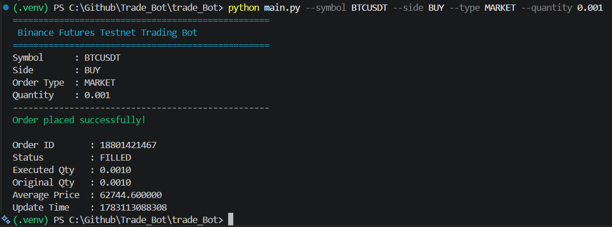
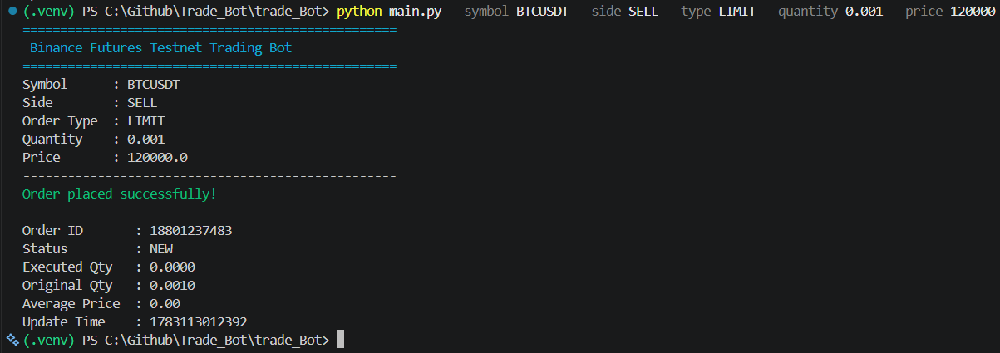

# Binance Futures Testnet Trading Bot


A modular Python trading bot for the **Binance Futures Testnet (USDT-M)**. The application supports placing **Market** and **Limit** orders through a command-line interface, with robust validation, structured logging, and clean project architecture.

---

## Features

- Place **Market Orders**
- Place **Limit Orders**
- Support for **BUY** and **SELL**
- Command Line Interface (CLI)
- Environment variable configuration using `.env`
- Input validation
- Structured logging
- Order status tracking
- Clean modular architecture
- Type hints and documentation
- Ready for PyQt5 GUI integration

---

## Project Structure

```
Trade_Bot/
│
├── bot/
│   ├── client.py
│   ├── cli.py
│   ├── config.py
│   ├── logger.py
│   ├── orders.py
│   └── validators.py
│
├── logs/
│   └── trading.log
│
├── screenshots/
│
├── .env.example
├── .gitignore
├── LICENSE
├── README.md
├── requirements.txt
└── main.py
```

---

## Technologies Used

- Python 3.11+
- python-binance
- argparse
- python-dotenv
- colorama
- logging
- Binance Futures Testnet API

---

## Installation

### Clone the repository

```bash
git clone https://github.com/soumallyasarkar/Trade_Bot.git

cd Trade_Bot
```

### Create Virtual Environment

```bash
python -m venv .venv
```

Windows

```bash
.venv\Scripts\activate
```

Linux / macOS

```bash
source .venv/bin/activate
```

### Install Dependencies

```bash
pip install -r requirements.txt
```

---

## Configuration

Create a `.env` file.

```env
API_KEY=YOUR_API_KEY
API_SECRET=YOUR_SECRET_KEY
TESTNET_URL=https://testnet.binancefuture.com/fapi
```

Generate your API credentials from the Binance Futures Testnet.

---

## Usage

### Market BUY Order

```bash
python main.py --symbol BTCUSDT --side BUY --type MARKET --quantity 0.001
```

### Market SELL Order

```bash
python main.py --symbol BTCUSDT --side SELL --type MARKET --quantity 0.001
```

### Limit BUY Order

```bash
python main.py --symbol BTCUSDT --side BUY --type LIMIT --quantity 0.001 --price 60000
```

### Limit SELL Order

```bash
python main.py --symbol BTCUSDT --side SELL --type LIMIT --quantity 0.001 --price 120000
```

---

## Example Output

```
==================================================
 Binance Futures Testnet Trading Bot
==================================================

Symbol      : BTCUSDT
Side        : BUY
Order Type  : MARKET
Quantity    : 0.001

--------------------------------------------------

Order placed successfully!

Order ID       : 18793404583
Status         : FILLED
Executed Qty   : 0.0010
Original Qty   : 0.0010
Average Price  : 62410.100000
Update Time    : 1783109927392
```

---

## Logging

Every API request and response is logged to

```
logs/trading.log
```

Example

```
2026-07-04 01:27:42 | INFO | LIMIT ORDER | Symbol=BTCUSDT Side=SELL Qty=0.001 Price=120000.0

2026-07-04 01:27:43 | INFO | SUCCESS | OrderID=18790209775 Status=NEW
```

---

## Validation

The application validates:

- Trading Symbol
- Order Side
- Order Type
- Quantity
- Price (for LIMIT orders)

Invalid inputs are rejected before sending requests to Binance.

---

## Current Functionality

| Features | Status |
|---------|:------:|
| Binance Connection | Done |
| Environment Configuration | DOne |
| Logging | Done |
| Input Validation | Done |
| Market Orders | Done |
| Limit Orders | Done |
| Order Status | Done |
| CLI Interface | Done |
| Colored Terminal Output | Done |

---

## Planned Features

- PyQt5 Desktop GUI
- Wallet Balance
- Position Information
- Open Orders
- Cancel Order
- Order History
- Dashboard Interface
- Real-time Position Monitoring

---

## Requirements

```
python-binance
python-dotenv
colorama
```

Install

```bash
pip install -r requirements.txt
```

---

## Screenshots

### Market Order



---

### Limit Order



---


## License

This project is licensed under the MIT License.

---

## Disclaimer

This project is intended for educational purposes and uses the **Binance Futures Testnet**. No real funds are used.
